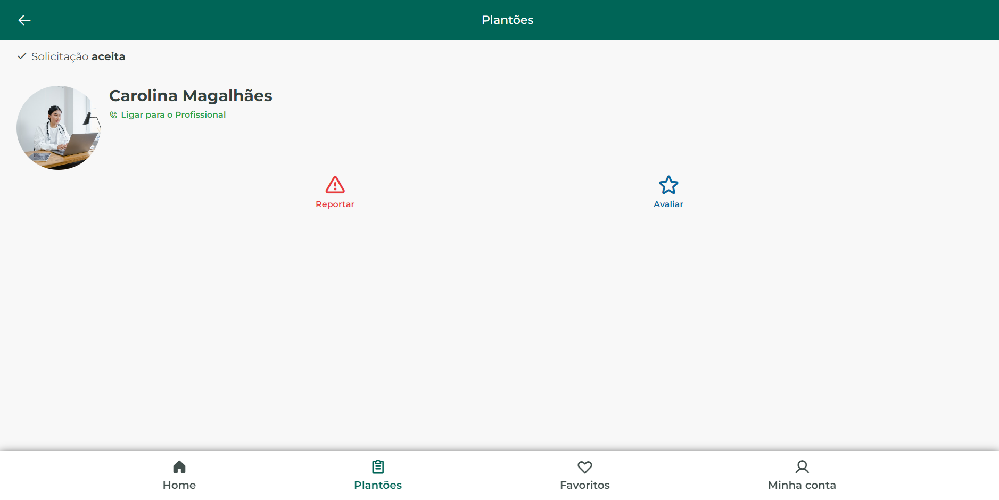
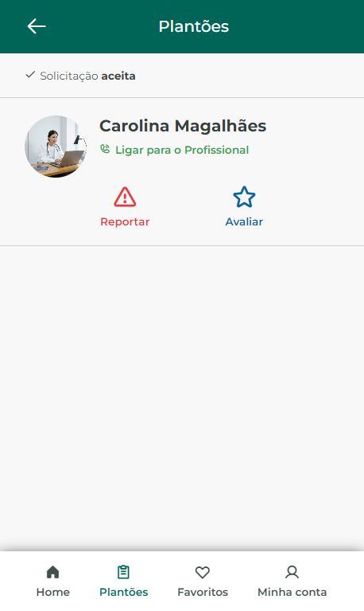

# Teste para vaga UpBase Consultoria

## Projeto desenvolvido utilizando Angular 🚀
- **Libs/Dependências utilizadas** 📙
- > **[angular-cli-ghpages](https://hfidelis.github.io/fipe-query/#/home) : Deploy no GitHub Pages**
- > **[phosphoricons](https://hfidelis.github.io/fipe-query/#/home) : Ícones**

## ACESSO 🌎
- > **[https://hfidelis.github.io/teste-upbase/](https://hfidelis.github.io/teste-upbase/) : Via link, projeto em produção disponível para Desktop e Mobile responsivo.**
## Teste local 🔧
**Considerando que você tenha o NodeJS e o GIT em sua máquina:**
- > **clone o projeto** ``git clone https://github.com/hfidelis/teste-upbase.git``
- > **acesse o diretório do projeto** ``cd teste-upbase``
- > **instale as dependências** ``npm install``
##### **inicie o projeto na sua máquina** ✔️
- > **Caso possua o Angular CLI** ``ng serve``
- > **Caso não possua** ``npm run start``
- > **O projeto vai estar disponível para acesso no seu navegador através da porta padrão http://localhost:4200**

## Preview Web :computer:

## Preview Mobile :iphone:

